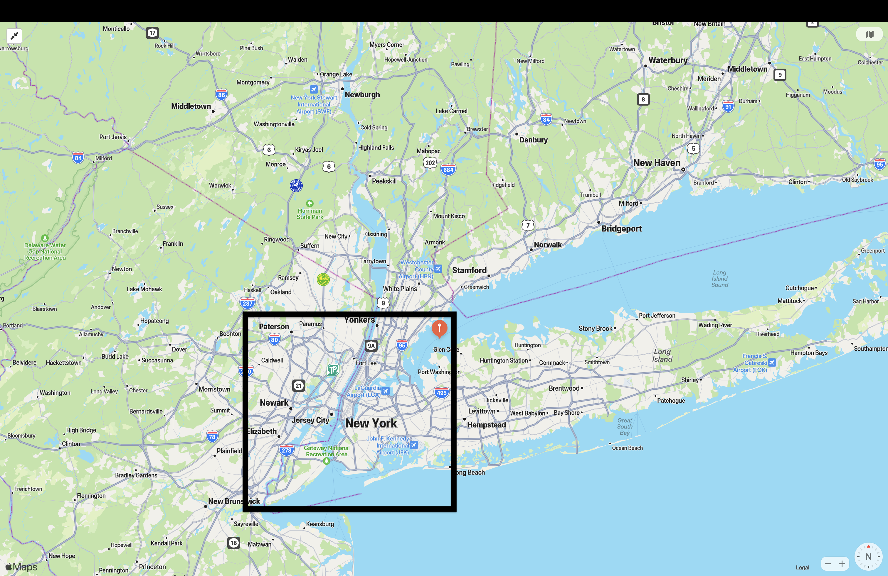
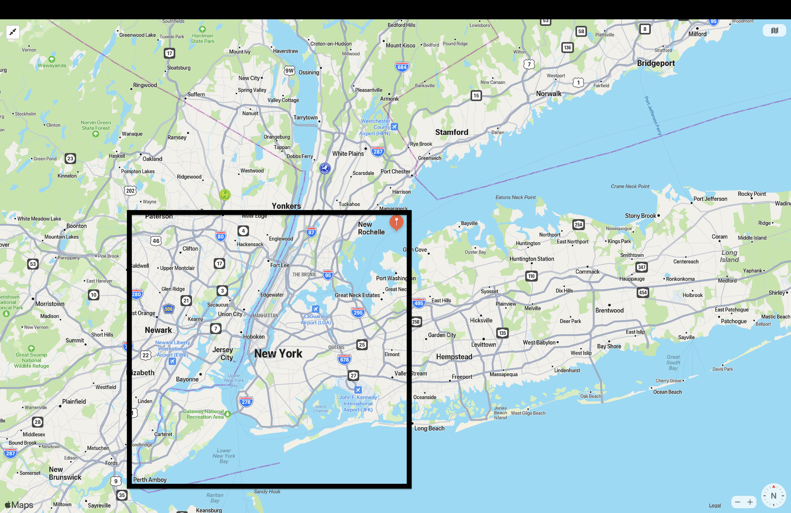

# _Project - NYC Taxi Trips._

## _1. What datetime range does your data cover?  How many rows are there total?_ 
 

_-> Datetime range minimum is:  **2013-02-01 00:00:00**  and maximun is:  **2013-02-28 23:59:59**._  
_-> Total Number of Rows:  **13990170**_  
 
## _2. What are the field names?  Give descriptions for each field._  
 

_-> Field names are: **['medallion', 'hack_license', 'vendor_id', 'rate_code', 'store_and_fwd_flag', 'pickup_datetime', 'dropoff_datetime', 'passenger_count', 'trip_time_in_secs', 'trip_distance', 'pickup_longitude', 'pickup_latitude', 'dropoff_longitude', 'dropoff_latitude']**_  
 
**-> Medallion:** _Medallion number is a unique id which is used to identify the vechicle issued by the license commission._ 
 
**-> Hack_license:** _Hack license means a valid license to operate a for-hire vechile issued by a city, county, town or village._ 
 
**-> Vendor_id:** _A unique identifier for each trip._ 
 
**-> Rate_code:** _Rate code is used to calculate the taxi fares, depends on the rate code fare is fixed for example rate code 5 indicates out of the city._ 
 
**-> Store_and_fwd_flag:** _This flag indicates whether the trip record was held in vehicle memory before sending to the vendor because the vehicle did not have a connection to the server. Y=store and forward; N=not a store and forward trip._ 
 
**-> Pickup_datetime:** _It indicates date and time when the meter was engaged_ 
 
**-> Dropoff_datetime:** _It indicates date and time when the meter was disengaged_ 
 
**-> Passenger_count:** _The number of passangers are get into the car for a particular trip._ 
 
**-> Trip_time_in_secs:** _The amount of time taken to complete the trip is mentioned in the seconds_ 
 
**-> Trip_distance:** _Here the entire trip distance covered is mentioned_ 
 
**-> Pickup_longitude:** _The longitude where the meter was engaged._ 
 
**-> Pickup_latitude:** _The latitude where the meter was engaged._ 
 
**-> Dropoff_longitude:** _The longitude where the meter was disengaged._ 
 
**-> Dropoff_latitude:** _The latitude where the meter was disengaged._ 
 
## _3. Give some sample data for each field._ 
 

medallion | hack_license | vendor_id | rate_code | store_and_fwd_flag | pickup_datetime | dropoff_datetime | passenger_count | trip_time_in_secs | trip_distance | pickup_longitude | pickup_latitude | dropoff_longitude | dropoff_latitude
--- | --- | --- | --- | --- | --- | --- | --- | --- | --- | --- | ---| --- | --- 
1B5C0970F2AE8CFFBA8AE4584BEAED29 | D961332334524990D1BBD462E2EFB8A4 | CMT | 1 | N | 2013-02-08 23:35:14 | 2013-02-08 23:42:58 | 1 | 463 | .80 | -73.992439 | 40.724487 | -73.984421 | 40.718903
B42249AE16E2B8E556F1CB1F940D6FB4 | D4BB308D1F3FCB3434D9DB282CDC93D7 | CMT | 1 | N | 2013-02-07 12:20:16 | 2013-02-07 12:50:27 | 4 | 1810 | 3.10 | -73.989494 | 40.769588 | -73.990303 | 40.737347
890699222C47C09FBC898758CEC69762 | 6318C3AEC02248928C3345B5805EB905 | CMT | 1 | N | 2013-02-08 08:56:54 | 2013-02-08 08:59:43 | 1 | 168 | 1.00 | -73.963036 | 40.799141 | -73.972168 | 40.786446
74B7D835C2CD98606D5256DA8A38E045 | D5E278C918256D1F97680A1F04D290E0 | CMT | 1 | N | 2013-02-08 09:37:02 | 2013-02-08 09:50:50 | 1 | 828 | 2.10 | -73.987953 | 40.728764 | -74.007118 | 40.705399
4003B8478418FEC5D761E2F37602769B | 0B766F1054A5C16D86BC023858BD8143 | CMT | 1 | N | 2013-02-08 19:31:25 | 2013-02-08 19:46:23 | 1 | 897 | 3.30 | -73.987282 | 40.743042 | -74.010284 | 40.703964
D72DF7B12201912BFDBB93081EF04C96 | AFD828EEF790A2485BBB0B568A8BE22E | CMT | 1 | N | 2013-02-08 23:10:01 | 2013-02-08 23:46:15 | 4 | 2173 | 7.60 | -73.993004 | 40.720154 | -73.959747 | 40.80854  

 

## _4. What MySQL data types / len would you need to store each of the fields?_ 
 

**Medallion: varchar(32)** 
**Hack_license : varchar(32)** 
**Vendor_id : varchar(3)** 
**Rate_code : int(1)** 
**Store_and_fwd_flag : varchar(1)** 
**Pickup_datetime : datetime** 
**Dropoff_datetime : datetime** 
**Passenger_count : int(1)** 
**Trip_time_in_secs : int(5)** 
**Trip_distance : decimal(1,2)** 
**Pickup_longitude : decimal(2,6)** 
**Pickup_latitude : decimal(2,6)** 
**Dropoff_longitude : decimal(2,6)** 
**Dropoff_latitude : decimal(2,6)** 
 
## _5. What is the geographic range of your data (min/max - X/Y)_ 
 

** Minimum value in the 'pickup_latitude' row: 40.5 
Maximum value in the 'pickup_latitude' row: 40.899998 
Minimum value in the 'pickup_longitude' row: -74.25 
Maximum value in the 'pickup_longitude' row: -73.700035 
Minimum value in the 'dropoff_latitude' row: 40.5 
Maximum value in the 'dropoff_latitude' row: 40.899994 
Minimum value in the 'dropoff_longitude' row: -74.25 
Maximum value in the 'dropoff_longitude' row: -73.700005 **
 
**-> Pickup plotting:** 
 

 
 
**-> Dropoff plotting:** 
 

 
 
## _6. What is the average computed trip distance?_ 
 

_->Average Haversine Distance: **19.48 km**_ 
 

## _7. What are the distinct values for each field? (If applicable)_ 
 

vendor_id | rate_code | store_and_fwd_flag | passenger_count
--- | --- | --- | --- 
3 | 4 | 4 | 13
 

 

## _8. For other numeric types besides lat and lon, what are the min and max values?_ 

 

_->Minimum Value of rate_code: **0**  Maximum Value of rate_code: **79** 
->Minimum Value of datetime: **2013-02-01 00:00:00**  Maximum Value of datetime: **2013-02-28 23:59:59** 
->Minimum Value of passenger count: **0**  Maximum Value of passenger count: **208** 
->Minimum Value of trip time in seconds: **0**  Maximum Value of trip time in seconds: **10800**_ 

 

## _9. Create a chart which shows the average number of passengers each hour of the day. (X axis should have 24 hours)_ 
 

_-> Here we calculated the values and store that to new .xlsx file after storing the values with help of google docs the map is plotted like this._

**-> Chart:**
 
.png)
 

## _10. Create a new CSV file which has only one out of every thousand rows._ 
 

_-> Created the new csv file with reduced dataset and saved will see the difference with new graph in next steps._
 

## _11. Repeat step 9 with the reduced dataset and compare the two charts._
 

_-> Same as above graph after calculating average values export to a new .xlsx file and with help of google docs created the chart._

_-> Here we clearly see the average value difference from the above grap._ 
 
.png) 
 
